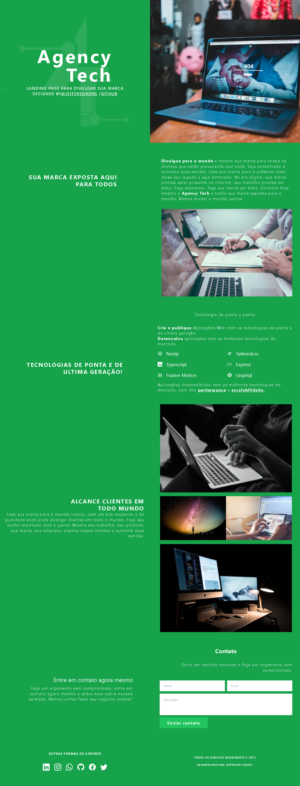

## Landing Page 

Como rodar o projeto:
1 Clone no repositório
2 npm run install
Congratulations, o app está no endereço: http://localhost:3000/

### Tecnlogias utilizadas: 
TailwindCss
Nextjs
ReactIcons
Typescript
Framer Motion

### Layout

    

